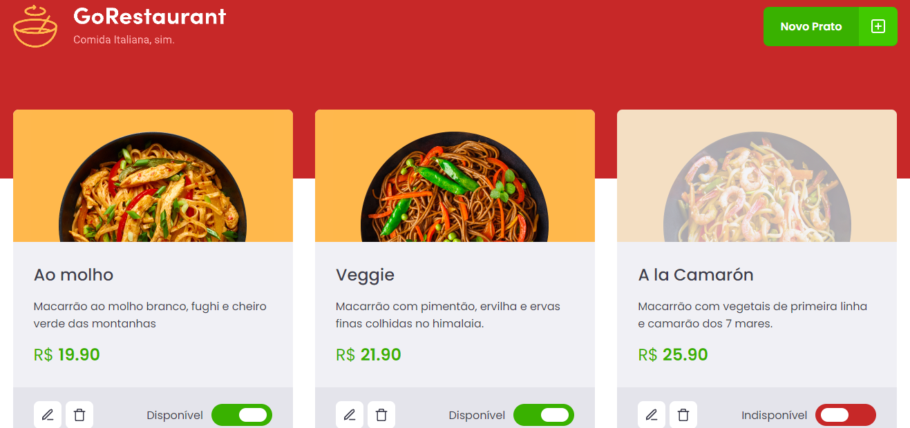

# GoRestaurant

> Ignite - Desafio complementar

  

O desafio neste projeto é refatorar todo o código que esta usando `Class Components` para `Function Components`, também é necessário refatorar o codigo do Javascript para o Typescript.
